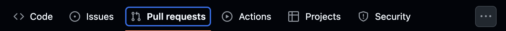
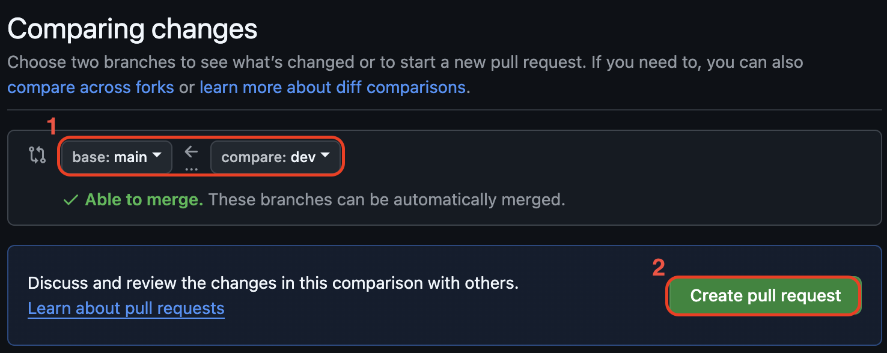
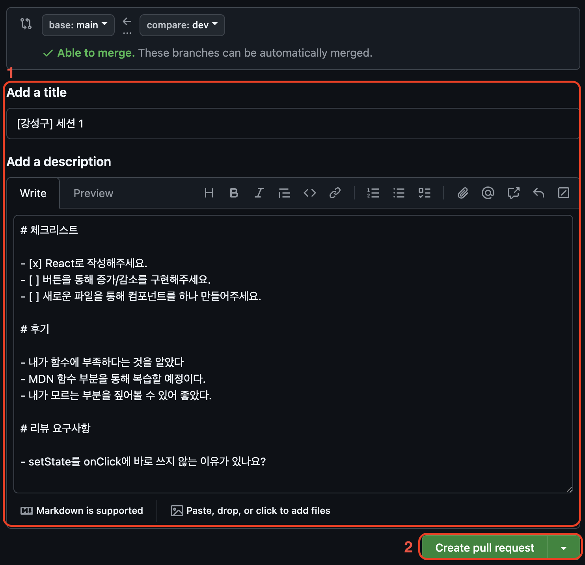

# 이번주 과제

- 버튼을 통해 숫자를 증감시킬 수 있는 Counter 페이지를 만들어주세요.

## 요구사항

- [ ] React를 사용하여 만들어주세요.
- [ ] `+`버튼을 누르면 1씩 증가하게 만들어주세요.
- [ ] `-`버튼을 누르면 1씩 감소하게 만들어주세요.
- [ ] CounterPage.jsx 파일을 만들어서 작성하고, 페이지에 나타나게 만들어주세요.
- [ ] GitHub Pull Requset를 이용하여 제출해주세요.

## GitHub를 활용한 제출방법

1. 레포지토리 clone 받기
2. Git Branch 만들기

- `git branch [브랜치 이름]` 명령어를 통해 브랜치를 만들어주세요.
- `git checkout [브랜치 이름]` 명령어를 통해 해당 브랜치로 이동해주세요.
- 브랜치 이름은 `세션-[N]-[이름]`으로 해주세요.
- 예시) git branch 세션-1-강성구, git checkout 세션-1-강성구

3. 과제 수행하기(커밋하기)

- 과제는 자신의 폴더에서 진행해주세요.
- 요구사항을 최대한 모두 지켜주세요.
- 자신의 폴더 내부 `README.md` 파일을 만들고 요구사항을 작성해주세요.
- `- [ ] 요구사항`과 같이 작성하면 README 내에 체크박스를 만들 수 있습니다.
- `- [x] 요구사항`과 같이 작성하면 체크박스를 채울 수 있습니다.

4. 브랜치에 push 하기

- `git push origin [브랜치 이름]` 으로 진행해주세요.
- 예시) `git push origin 세션-1-강성구`
- **`main` 브랜치로 push하지 않게 조심해주세요.**

5. main 브랜치에 Pull Request 올리기

## GitHub Pull Request 이용하기

1. 레포지토리의 Pull Request 탭을 찾아가기
   
2. 레포지토리 생성하기
   
3. 병합할 브랜치 설정하고 `Create pull request` 버튼 클릭하기
   

- 병합할 브랜치는 `base:main`, `compare:[과제를 작성한 브랜치 이름]`으로 설정합니다.
- 예시) `base:main` <- `compare: 세션-1-성구`
- 기본적으로 드랍다운을 통해 선택할 수 있습니다.

4. Pull Request 작성하고 `Create pull request` 버튼 클릭하기
   
